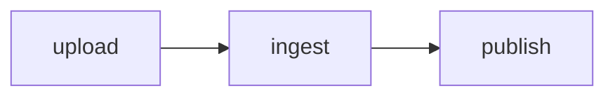

# Diagrams, formulas, interaction, animation

Five layers. **Use the cheapest one that does the job**, and say the cost of
anything past the first.

| Layer | You write | Runs where | Cost |
|---|---|---|---|
| 1 · built-in chart | data | server | none |
| 2 · components | data | server | none |
| 3 · hosted library | a declaration | the reader's browser | needs JS; a download |
| 4 · behaviours | nothing | the reader's browser | none |
| 5 · `embed` | HTML + JS | an isolated origin | that block is not indexed |

## Layer 1 — charts

` ```chart ` covers bar, column, line, area, pie, donut and scatter. Rendered to
SVG on the server, with a data table underneath. **Costs nothing**: indexed,
printable, readable with JS off, correct in dark mode, legible on a phone.

Reach for layer 3 only when the reader needs to *interact* — hover a value, zoom
a range, pan a map. A static comparison of four numbers does not.

## Layer 2 — components

`stats` `steps` `timeline` `compare` `faq` `gallery` cover most of what people
draw diagrams for. A three-step process is a `steps` block, not a flowchart.

## Layer 3 — hosted libraries

| id | Draws | Blocks | About |
|---|---|---|---|
| `mermaid` | flowcharts, sequence, gantt, class, state | ` ```mermaid ` | 2.5 MB |
| `katex` | TeX maths | ` ```math `, `$…$`, `$$…$$` | 280 KB + fonts |
| `echarts` | interactive charts, maps | ` ```echarts ` | 1 MB |
| `abcjs` | music notation | ` ```abc ` | 420 KB |
| `shiki` | syntax highlighting | code blocks | 320 KB |

### Enable it, or it stays a code block

```yaml
---
title: How ingest works
libs: [mermaid]
---
```

````

````

For formulas, enable `katex` instead. Use `$E=mc^2$` inline, a `$$…$$`
paragraph for display maths, or a ` ```math ` fence for a larger block. Dollar
syntax is parsed only when `katex` is enabled, so ordinary prices remain text.

Without `libs:`, the block renders as a code block with a caption saying which
one line to add, and `pagewell check` reports it. **This is deliberate**: every
library is a download, and who pays for it should be an explicit decision.

### What the reader gets

The declaration text stays in the DOM. Search engines, screen readers,
`llms.txt`, "copy as text" and readers without JavaScript all get the source —
never a blank box. The library upgrades it in place when it loads.

### Say three things before using one

1. The picture needs JavaScript. Crawlers get the source text.
2. It costs a download on first open. The tool kit gives the size.
3. Whether layer 1 or 2 would do.

### Why we host them

The reading page carries session and share credentials. A script loaded from a
third-party origin runs with those. Subresource integrity stops a file being
swapped; it does not stop us upgrading to a poisoned version. So the bytes are
ours, the versions are pinned in the repo, and the reading page's `script-src`
is `'self'` — no third-party origin appears at all.

You cannot point at an arbitrary CDN. The escape hatch is layer 5.

## Layer 4 — behaviours

Interaction without JavaScript of your own: `steps` `tabs` `accordion`
`compare` `hotspot` `scrolly` `carousel` `lightbox` `counter` `reveal`
`sticky-toc` `sync`. A component declares one; the platform implements it.

**Every state is in the DOM** — JS only decides which is visible. So they cost
nothing in indexing, and they all degrade to "show everything" under
`prefers-reduced-motion`, in print, and with JS off.

See `components.md` for the table.

## Animation

Pure CSS animation is allowed in a theme: `@keyframes`, `animation`,
`transition`, `transform`, `filter`, and scroll-driven `animation-timeline`.

Two rules:

1. **Respect `prefers-reduced-motion`.** Not optional. Behaviours already do;
   your own CSS must too.
2. **Animation is never the only carrier of content.** A sentence that appears
   only after an animation is a sentence search engines cannot read and a
   printer cannot print.

A template can set `motion: off` to turn all of it off — right for anything
built to be printed.

## Layer 5 — `embed`

````
```embed
title: Compound interest simulator
height: 420
poster: https://…/preview.png
note: Drag the rate to see it compound.
html: |
  <canvas id="c"></canvas>
  <script>/* your code */</script>
```
````

- runs on an **isolated origin**, in an iframe with `sandbox="allow-scripts"`
  and nothing else: no same-origin, no forms, no top navigation, no modals,
  and a CSP with `connect-src 'none'` — it cannot reach the network
- **the rest of the page keeps its search indexing.** This is the whole point.
  Publishing the entire document as HTML costs you the whole page; an `embed`
  costs you one block
- the `title`, `note` and `poster` sit outside the frame, so crawlers and
  readers without JS get "there is a simulator here", not an empty rectangle
- at most 4 per document. Past that, the isolated blocks outweigh the indexed
  ones and you may as well publish the whole thing as HTML

⛔ Do not put a form or a login box in an `embed`. The sandbox withholds
`allow-forms`, and the platform forbids publishing pages that collect
credentials.

## Choosing, in one paragraph

If it is data, use a chart. If it is a process, use `steps`. If it is a real
diagram — a graph with edges, a sequence, a state machine — enable `mermaid` and
say what it costs. If the reader must manipulate something, use a behaviour if
one fits, and an `embed` if none does. Publish the whole document as HTML only
when it is genuinely one application, and say that search engines will only see
the summary.
